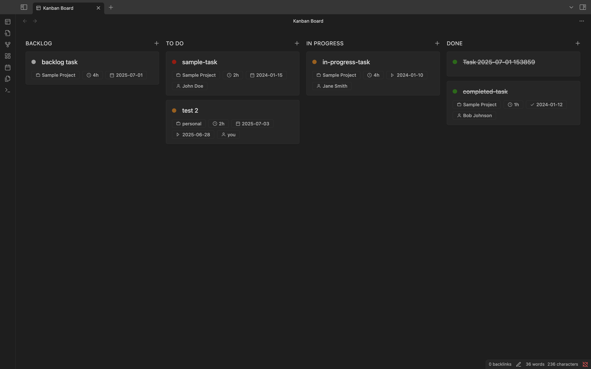
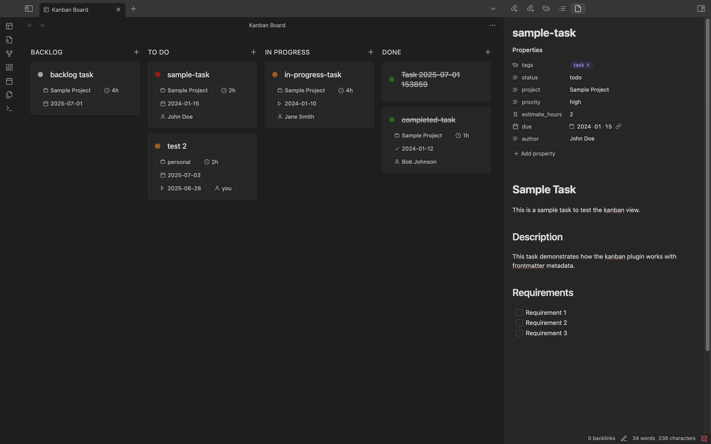

# Obsidian Kanban Plugin

> **⚠️ Active Development Disclaimer**  
> This plugin is currently in active development. Features may change, bugs may exist, and the API is not yet stable. Use at your own risk and expect breaking changes in future updates.

A simple kanban board view for Obsidian that displays tasks from your vault based on frontmatter metadata. **Inspired by Linear's UI design.**

## Screenshots


*Main kanban board interface showing tasks organized by status*


*Example of a task card with metadata badges*

## Features

- **Kanban Board View**: View your tasks in a kanban board layout with columns for "Backlog", "To Do", "In Progress", and "Done"
- **Modern Drag & Drop**: Smooth drag and drop using Atlaskit's pragmatic drag and drop library 
- **Task Detection**: Automatically detects tasks based on frontmatter tags
- **Rich Metadata Display**: Shows project, priority, estimates, due dates, and more
- **Click to Open**: Click on any task to open the corresponding note
- **Add Tasks**: Add new tasks directly from any column with the + button
- **Auto-refresh**: Board automatically updates when files are created, modified, or deleted
- **Responsive Design**: Works well in different view sizes

## How to Use

### 1. Create Task Notes

Create markdown files with the following frontmatter structure:

```yaml
---
tags: [task]
status: todo  # or "doing" or "done"
project: "Project Name"
priority: high  # or medium, low
estimate_hours: 2
due: "2024-01-15"
started_at: "2024-01-10"  # for in-progress tasks
completed_at: "2024-01-12"  # for completed tasks
author: "Your Name"
---
```

### 2. Required Fields

- **tags**: Must include "task" (case-insensitive)
- **status**: Determines which column the task appears in
  - `backlog` → "Backlog" column
  - `todo` or any other value → "To Do" column
  - `doing` → "In Progress" column  
  - `done` → "Done" column

### 3. Optional Fields

- **project**: Project name
- **priority**: Task priority (high, medium, low)
- **estimate_hours**: Time estimate in hours
- **due**: Due date
- **started_at**: When work began
- **completed_at**: When work was completed
- **author**: Task assignee

### 4. Open the Kanban View

1. Use the ribbon icon (layout icon) in the left sidebar
2. Or use the command palette: "Open Kanban Board"
3. The kanban view will open in a new pane

### 5. Using Drag & Drop

- **Move Tasks**: Click and drag any task card to move it between columns or reorder within the same column
- **Status Update**: When you drop a task in a new column, its status is automatically updated in the markdown file
- **Position Tracking**: Tasks maintain their order within columns using an `order` field in frontmatter
- **Visual Feedback**: Columns highlight when you drag over them, and tasks show a visual indicator while being dragged
- **Auto-scroll**: Columns automatically scroll when dragging near the edges
- **Add Tasks**: Click the + button in any column header to add a new task with that column's status

## Example Task Files

### To Do Task
```yaml
---
tags: [task]
status: todo
project: "Website Redesign"
priority: high
estimate_hours: 8
due: "2024-01-20"
author: "John Doe"
---

# Design Homepage

Create a new homepage design for the company website.
```

### In Progress Task
```yaml
---
tags: [task]
status: doing
project: "Website Redesign"
priority: medium
estimate_hours: 4
started_at: "2024-01-10"
author: "Jane Smith"
---

# Implement Navigation

Build the main navigation component.
```

### Completed Task
```yaml
---
tags: [task]
status: done
project: "Website Redesign"
priority: low
estimate_hours: 2
completed_at: "2024-01-12"
author: "Bob Johnson"
---

# Setup Project

Initialize the project structure and dependencies.
```

## Installation

1. Copy this plugin folder to your Obsidian vault's `.obsidian/plugins/` directory
2. Enable the plugin in Obsidian settings
3. Use the ribbon icon or command palette to open the kanban view

## Development

To build the plugin:

```bash
npm install
npm run build
```

For development with hot reload:

```bash
npm run dev
```

## License

MIT
